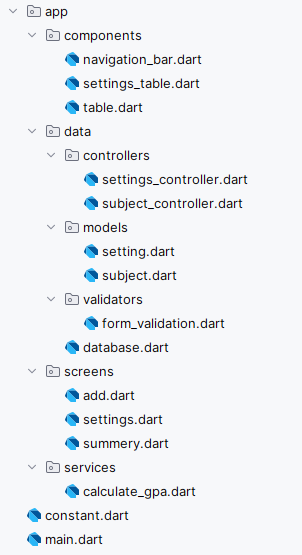

# GPA App
 Mobile application for calculating GPA  
# Features  
- Add, edit, modules data
- Real-time GPA calculation
- SQLite database for persistent storage
# Demo 🎥

# Getting Started to dev environment

Prerequisites
- Flutter (Latest version)
- Dart SDK
- Git
# Installation  
1. Clone the repo
    https://github.com/RukshanRanasinghe2000/gpa_cal.git
2. Install dependencies
   ```flutter pub get```
3. Run the app
   ```flutter run```
# Dependencies
```cupertino_icons: ^1.0.8
  qflite: ^2.4.1
  path: ^1.9.0
  mockito: ^5.4.5
  build_runner: ^2.4.15
  sqflite_common_ffi: ^2.3.4+4
```
# Project structure   

   
   
